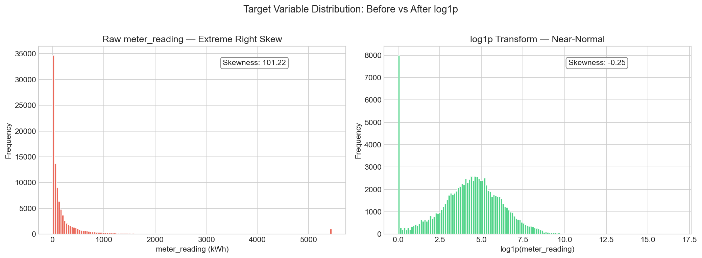
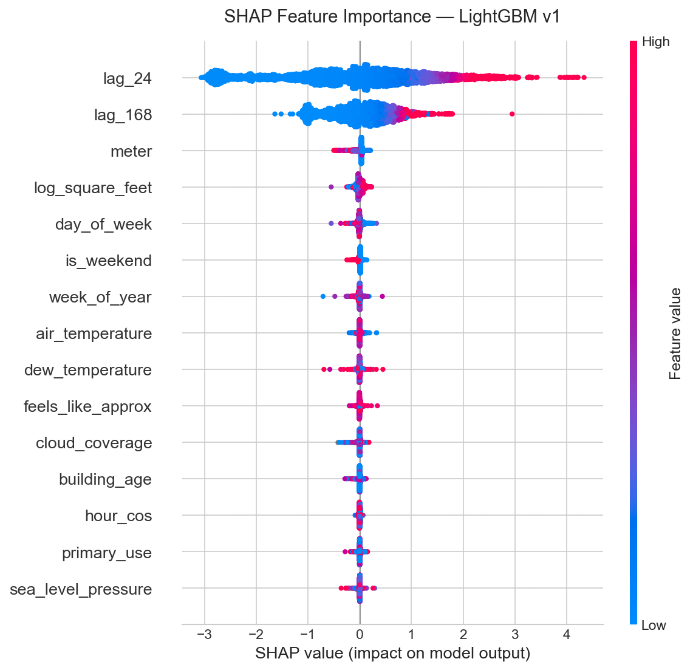
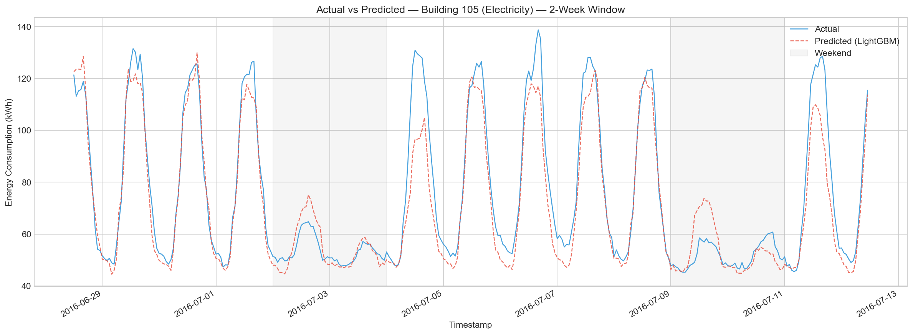
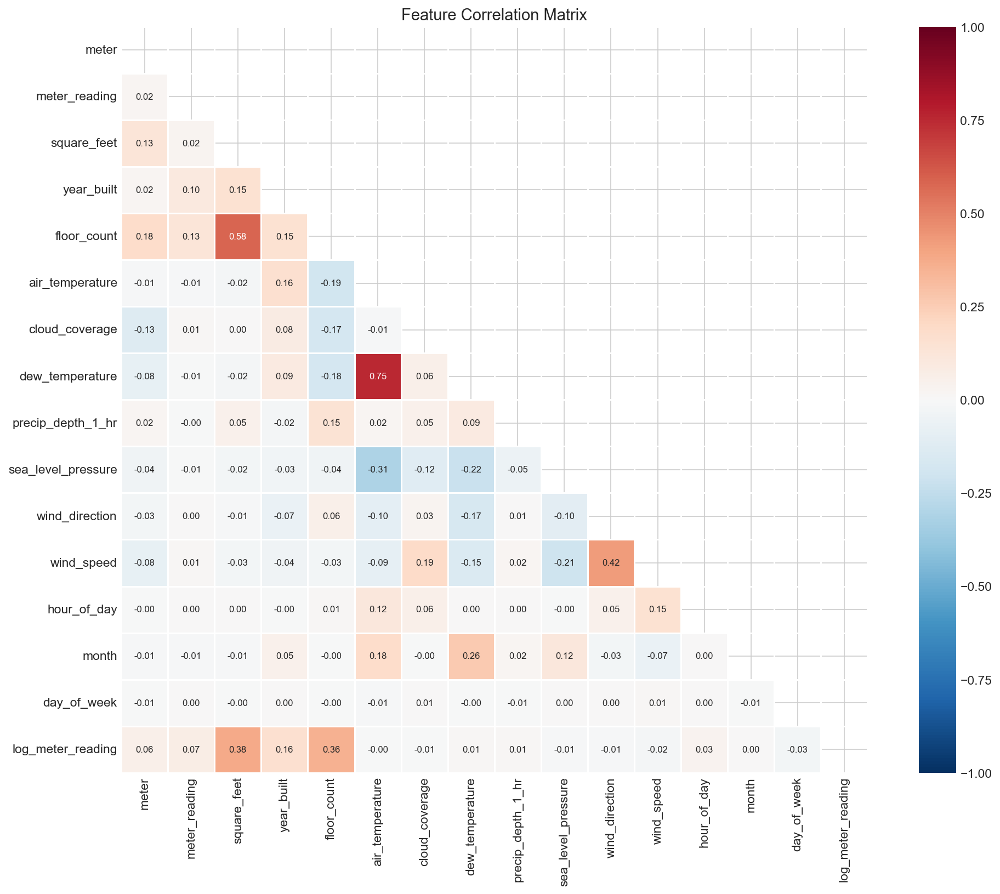

> **Interactive Reports:**
> [Statistical Inference](https://yu-wang20.github.io/ASHRAE_Portfolio/02_statistical_inference.html) |
> [SHAP Interpretability](https://yu-wang20.github.io/ASHRAE_Portfolio/04_interpretability.html)

# ASHRAE Energy Predictor — End-to-End Portfolio

A production-grade data science portfolio demonstrating **rigorous statistical inference** combined with **industrial-scale ML engineering**. Built on 20M+ hourly energy readings from 1,448 buildings across 16 sites in the [ASHRAE Great Energy Predictor III](https://www.kaggle.com/competitions/ashrae-energy-prediction) competition. Every classical assumption is tested, every violation is quantified, and every modelling decision is mathematically justified.

---

## Architecture Philosophy

This repository uses a **hybrid notebook + modular code** design. Jupyter notebooks handle mathematical storytelling — derivations, diagnostic plots, and narrative that explain *why* each statistical decision was made, designed to be read linearly like a technical paper. Modular Python scripts in `src/` handle the full-scale production pipeline on 20M+ rows — importable, testable, and reproducible via YAML configuration. Notebooks import directly from `src/`, so every figure and table is backed by the same code that runs at scale. This avoids the common pitfall of "works in notebook, breaks in production."

| Layer | Location | Purpose |
|-------|----------|---------|
| **Notebooks** | `notebooks/` | Statistical theory, diagnostics, visualisations — the "why" |
| **Modular scripts** | `src/` | Production pipeline code — the "how at scale" |
| **Configuration** | `configs/` | Single source of truth for all hyperparameters and paths |

---

## Key Results

### Model Progression

The portfolio follows a deliberate narrative arc: start with classical OLS, expose every assumption violation, then justify the transition to tree models.

| Model | RMSLE | R² | Features | Notes |
|-------|------:|---:|----------|-------|
| OLS Baseline | 1.8122 | — | 22 static | Classical MLR on log1p target |
| Ridge (CV) | 1.8123 | — | 22 static | L2 regularisation — stability, not accuracy |
| Lasso (CV) | 1.8123 | — | 21 static | L1 sparsity — zeroes out 1 feature |
| **LightGBM v1** | **0.7343** | **0.8764** | **25 (+ lags)** | **59.5% RMSLE improvement over OLS** |

### Target Distribution — Why log1p?

Raw meter readings are extremely right-skewed. The log1p transform produces a near-normal distribution AND directly connects to the competition's RMSLE metric.



### SHAP Feature Importance — What Drives Predictions?

Lag features dominate: a building's consumption yesterday and last week are the strongest predictors — exactly the temporal dependence that OLS cannot capture.



### Actual vs Predicted — 2-Week Time Series

The model captures diurnal cycles, weekend drops, and temperature responses with high fidelity.



### Feature Correlations — Multicollinearity Landscape

The correlation heatmap identifies collinear feature pairs (air_temperature ↔ dew_temperature > 0.85) flagged in the VIF analysis.



---

## Data Pipeline

```
Raw CSV (20,216,100 rows)
  │
  ├─ Site 0 kBTU→kWh correction ············ 908,409 rows fixed
  │    └─ Domain knowledge: Site 0 electricity in kBTU, not kWh
  │
  ├─ Anomaly removal ······················· 467,951 rows cleaned
  │    ├─ Stuck meters (≥24h identical readings)
  │    └─ Site 0 calibration period (first 141 days)
  │
  ├─ Weather imputation ···················· Per-site interpolation + ffill/bfill
  │
  ├─ Feature Engineering
  │    ├─ Cyclic encoding (hour_sin/cos, month_sin/cos)
  │    ├─ Building features (log_square_feet, building_age)
  │    ├─ Interaction features (temp × hour, feels_like_approx)
  │    └─ Lag features (lag_24h, lag_168h)
  │
  ├─ LightGBM Training ···················· Time-based split (Oct 2016 cutoff)
  │    └─ 1000 rounds, early stopping at best iteration
  │
  └─ Result ································ RMSLE: 0.7343 │ R²: 0.8764
```

---

## Project Structure

```
ASHRAE_Portfolio/
├── configs/
│   └── config.yaml                 # Central configuration (paths, seeds, model params)
├── data/
│   ├── README.md                   # Download instructions (Kaggle competition link)
│   └── *.csv                       # Raw competition data (git-ignored)
├── notebooks/
│   ├── 01_EDA.ipynb                # Exploratory analysis — distributions, patterns, correlations
│   ├── 02_statistical_inference.ipynb  # OLS diagnostics: VIF, Breusch-Pagan, Shapiro-Wilk, Cook's D
│   ├── 03_remediation.ipynb        # Box-Cox, WLS, Ridge/Lasso — remediation attempts
│   └── 04_interpretability.ipynb   # SHAP analysis, waterfall plots, time-series validation
├── src/
│   ├── __init__.py
│   ├── data_preprocessing.py       # ASHRAEDataLoader + ASHRAEPreprocessor (cleaning pipeline)
│   ├── feature_engineering.py      # FeatureEngineer (temporal, lag, rolling, interaction features)
│   ├── evaluate.py                 # ModelEvaluator (metrics, residual diagnostics, submissions)
│   └── run_training.py             # Memory-optimised LightGBM training (float32, 8GB-safe)
├── outputs/
│   ├── models/                     # Trained model artifacts (.pkl + metadata JSON)
│   ├── figures/                    # All saved plots (16 figures)
│   └── predictions/                # Competition submission CSVs
├── requirements.txt
├── .gitignore
└── README.md
```

---

## Key Statistical Findings

- **Box-Cox MLE: λ = 0.044 ≈ 0** — confirms `log1p` is the MLE-optimal variance-stabilising transform for this dataset. No need for more complex power transforms.

- **Breusch-Pagan test rejects homoscedasticity** — residual variance increases with fitted values (fan-shaped pattern), violating Gauss-Markov. WLS partially corrects standard errors but cannot fix the underlying nonlinearity.

- **Durbin-Watson statistic < 1.5** — confirms strong positive serial autocorrelation in hourly residuals, expected for time-series energy data. This motivates lag features over classical GLS corrections.

- **SHAP dominance of lag features** — `lag_24` (mean |SHAP| = 1.09) alone contributes more than all 23 static features combined (sum ≈ 0.35), quantifying exactly how much autoregressive information drives the 2.5× improvement.

---

## Setup Instructions

### Prerequisites

- Python 3.11+ (developed on 3.13)
- ~8 GB RAM (pipeline uses float32 downcasting for memory efficiency)
- ~2 GB disk for raw data + outputs

### Installation

```bash
# Clone the repository
git clone https://github.com/Yu-Wang20/ASHRAE_Portfolio.git
cd ASHRAE_Portfolio

# Create and activate virtual environment
python -m venv venv
source venv/bin/activate        # macOS/Linux
# venv\Scripts\activate         # Windows

# Install dependencies
pip install -r requirements.txt
```

### Data Download

1. Download from [Kaggle ASHRAE Competition](https://www.kaggle.com/competitions/ashrae-energy-prediction/data)
2. Place all CSV files in `data/` (see `data/README.md` for details)
3. Required files: `train.csv`, `building_metadata.csv`, `weather_train.csv`

### Run the Pipeline

```bash
# Step 1: Preprocess raw data → outputs/clean_data.parquet
python src/data_preprocessing.py

# Step 2: Train LightGBM → outputs/models/lgbm_v1.pkl
python src/run_training.py

# Step 3: Explore notebooks (run in order)
jupyter notebook notebooks/
```

---

## Notebooks Guide

| Notebook | Purpose | Key Output |
|----------|---------|------------|
| **01 — EDA** | Distributions, temporal patterns, weather correlations, missing data audit | 8 publication-ready figures establishing the data landscape |
| **02 — Statistical Inference** | OLS baseline → VIF → Breusch-Pagan → Shapiro-Wilk → Durbin-Watson → Cook's Distance → LOWESS | Every classical assumption tested and quantified; transition to nonlinear models justified |
| **03 — Remediation** | Box-Cox → WLS → Ridge/Lasso coefficient paths | Demonstrates classical fixes, proves they are insufficient, bridges to tree models |
| **04 — Interpretability** | SHAP beeswarm, dependence plots, waterfall explanations, time-series validation | Business-language feature interpretation; complete model comparison table |

---

## License

This project is released under the MIT License for educational and portfolio purposes.
